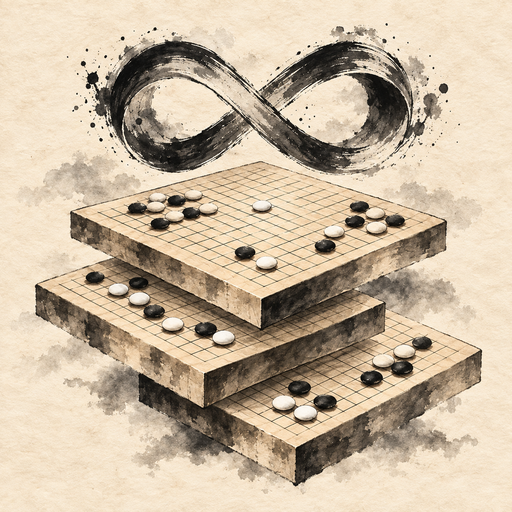

# Infinite Go



[中文](README.md) | English

**One move, another world. Keep the past and explore a different continuation.**

A local-first Go experiment with branching histories and exact weighted outcomes. By [vavilonska](https://github.com/vavilonska), open source under GNU AGPL v3 only (AGPL-3.0-only).

> v0.1 prototype: same-screen play, trusted-LAN rooms and optional self-hosted AI. No public matchmaking, accounts, cloud service or bundled AI model. Basic desktop interactions have been checked on the live site; real phones and two-device Wi-Fi still need device testing. See [verification notes](docs/TESTING.md).

## Static website and self-hosted backends

[Play Infinite Go](https://vavilonska.github.io/infinite-go/). The repository includes a GitHub Pages workflow. The static site supports same-screen human play without connecting to AI or a room service by default. GitHub Pages does not run Node or KataGo. See [Pages deployment boundaries](docs/PAGES.md).

Players provide their own LAN, virtual-LAN and AI backends. For games with friends, open the same frontend served by the host's Node server directly. Do not assume a public HTTPS page can connect to an HTTP LAN backend.

## Start playing

Requires Node.js 22 or newer. There are no npm dependencies; `npm install` is unnecessary.

```sh
git clone https://github.com/vavilonska/infinite-go.git
cd infinite-go
npm start
```

Open `http://localhost:8000`. Choose **9 / 13 / 19** lines (default 9), with configurable komi (default 7.5). The initial branching threshold defaults to **1/512**; options include 1/4 through 1/512, a custom negative integer power of two, or unlimited.

- Same screen: share the page, tap a position to preview, then confirm the move
- LAN: create a room; the other device opens the host's LAN address and joins directly if only one room is available. With multiple rooms, enter the six-character code. In manual mode the host chooses Black or White. Alternatively, use a nigiri room: the joining player guesses parity and the winner chooses a color. See the [LAN guide](docs/LAN.md)
- Offline same-screen play without rooms: serve statically with `python3 -m http.server 8000`, or use `HOST=127.0.0.1 npm start` to listen only on the local machine (PowerShell: `$env:HOST='127.0.0.1'`)
- Do not open the HTML file directly: ES modules need an HTTP server
- Export JSON before leaving. Refreshing loses an unexported same-screen game. LAN rooms live in server memory and disappear when the server stops. Exports exclude reconnection credentials

**Do not expose the room server to the public Internet or forward router ports.** HTTP is unencrypted and intended for trusted home/friend networks. The app does not change firewall settings.

Distant friends may configure a virtual LAN such as ZeroTier themselves; see the [remote-play guide](docs/REMOTE-PLAY.md). The page does not integrate a VPN, create networks or change security settings.

The board-side move-number toggle labels surviving stones with their actual move numbers (passes count; dispute-resume events do not). History previews show only that position; captured numbers disappear and reoccupied points receive new numbers. The branch-origin text retains its creation move, new/original coordinates and parent ID (coordinates skip I; passes are labeled as passes). A gold ring marks the branch move only while that stone survives; the teal/purple marker identifies the latest move.

## Optional nigiri and color selection

- Before same-screen play, start nigiri to generate and hide a uniformly random integer from 1 to 20. Guess odd/even, then reveal the number and that many stones. A correct guess gives the guesser first choice of color; otherwise the other player chooses. Same-screen results are an agreement between players, not an operator restriction
- For remote play, choose nigiri before creating the room. Players initially occupy seats A (host) and B (joining player). The server generates the hidden count before B guesses. The winner chooses Black or White; the other seat receives the opposite color. Moves are blocked until selection is complete. Manual host-color selection remains available
- In human/AI mode the human guesses and can choose a color after winning. If the AI wins, its initial policy chooses Black. AI/AI can skip nigiri and use its existing Black/White setup
- Cryptographic randomness and rejection sampling avoid modulo bias. Repeated guesses and color reassignment after play starts are rejected. LAN responses do not reveal the count early, but participants must trust the host server; this is not a cryptographic commitment or anti-cheat system. Temporary same-screen nigiri results are not included in game JSON exports

## Branching

1. Black and White have independent rounds with frozen pending-leaf sets. Freely choose a leaf that is pending for your current round and whose board is your turn. Your opponent may reply immediately; you must finish all your pending leaves before returning to the same leaf
2. On an eligible leaf, either play normally or use the history slider to return to an earlier node where your color was to move, then choose a different move
3. The old leaf keeps its entire history. The new leaf contains the shared history prefix plus the alternative move. Each receives **half** the source leaf's weight
4. Branching consumes the actor's opportunity on the source leaf, whose board turn remains unchanged. The newborn joins each player's next round snapshot. To prevent mutual waiting after branches, branching also defers the opponent's unused current opportunity on the old source to the next round. Ordinary moves do not defer the opponent's opportunity
5. A branch may branch again, but its parent weight must be **strictly greater than the configured threshold**. At or below it, only ordinary continuation is allowed. The strictest threshold is 1/4; the loosest is unlimited. For example, 1/2 splits into two 1/4 leaves, neither of which can branch again with a 1/4 threshold
6. Unlimited sets no branch-count, quantity, depth or weight cap; memory and device performance still impose practical limits. Custom exponents range from 2 to 4096, giving threshold `1 / 2^exponent`, compared with exact integers. Settings are fixed at game creation and preserved in exports. Older saves without a threshold retain their original unlimited rule

The list and tree use black/white stones to identify the player who can act. Red plus text indicates waiting for that player's remaining work; information does not depend on color alone. See [independent turns and save migration](docs/TURNS.md).

An existing outgoing edge from an identical full-history prefix cannot be duplicated, including edges created by ordinary play. Identical boards with different histories remain distinct. The tree represents actual shared-history junctions and terminal leaves, with the horizontal axis following move count. It supports node selection, folding, panning, wheel zoom and two-finger zoom. The old continuation is not treated as a permanently fixed internal leaf.

## Actual results

- Liberties and captures are local to each board. Suicide is forbidden. **Positional superko** checks every board in the branch's full inherited history; passes are exempt
- Two consecutive passes enter scoring and temporarily disable branching
- Both players mark whole dead groups. Chinese-style area scoring counts living stones, single-color enclosed empty points and White komi; neutral/shared empty points belong to neither player
- Changing dead stones clears both approvals. Settlement requires both players' approval. Disputes may resume play while retaining the previous superko history
- There is no automatic life-and-death referee. Disputed seki or ko should be played out or agreed upon; engine estimates are not formal rulings
- Sum the exact rational weights of **actually settled wins**. Strictly more than **1/2** locks in the overall winner; remaining games may still finish. If all finish without either side exceeding half, the overall result is a draw
- The UI shows both completed/total branches and settled weight; these measure different things

Weights are arbitrary-precision `BigInt` fractions stored as decimal strings. Percentages and AI charts are approximate displays only.

## Optional experimental pruning

Choose no pruning (default), resignation pruning or komi-compensation pruning when creating a game. Select a non-root history node on an eligible leaf; pruning targets the entire unsettled subtree sharing that full prefix, with a preview before confirmation. See [complete pruning rules and formulas](docs/PRUNING.md).

Compensation C offers **8 / 32 / 256 / custom**, default 32. Custom input shows the actual minimum newborn-leaf weight, percentage, raw minimum compensation and amount rounded upward to a half-point. For example, C20 uses **1/32 (3.125%)**, raw **0.625 points**, rounded to **1 point**, rather than the theoretical 1/40.

This is experimental pricing. It does not claim komi is equivalent to win probability, or guarantee that repeated pruning and branching terminate in finitely many moves.

## Optional AI

The UI offers human/human, human/AI and AI/AI modes. The latter two remain disabled, with empty charts, until a compatible service is connected. Then choose the human color and explicitly start or pause automatic moves.

A lightweight [KataGo bridge and provider protocol](docs/providers.md) is included. Install KataGo and obtain a compatible model/configuration separately. They are not bundled; no keys are embedded. Alternatively, implement the `capabilities / analyze / generateMove / cancel` HTTP protocol for your engine.

- The initial AI policy chooses its own eligible leaf by ID and advances it; it does **not automatically branch or prune**. AI modes apply to same-screen play; LAN seats remain human
- Analysis includes full history, rules, komi, request ID and history-node ID, with an explicit Black-winrate perspective
- Current-leaf Black winrate and global expected Black outcome weight have separate trends. The global value is `sum(leaf weight * Black winrate)`, replacing settled results with actual `1 / 0 / 0.5`
- **Weighted prediction is neither the probability of winning the whole match nor the formal result.** Stale/missing analysis is marked; incomplete data does not claim a current global estimate
- Trends retain up to 120 analyzed state samples, not necessarily every move
- Scoring pauses AI and still requires human review and approval. Read19, cloud engines and arbitrary GTP services are not claimed as supported. Standard GTP has no uniform winrate field

## Development and verification

```sh
npm test
```

The core is plain JavaScript with no build step. Layout:

- `engine.js`: captures, superko, branching, turns, exact weights, scoring and save validation
- `app.js` / `index.html` / `style.css`: responsive UI, move previews, saves and room client
- `tree.js`: shared-history prefix tree and gestures
- `server.js`: authoritative LAN rooms, roles, reconnection, revisions and illegal-action validation
- `ai.js` / `providers.js`: optional AI modes and separate prediction display
- `katago-bridge.js`: optional independent KataGo analysis-process bridge
- `test/`: Node's built-in test runner

No public matchmaking, accounts, ranking, cloud storage or production-security guarantees. Issues and pull requests on rule boundaries, touch usability, performance and compatible providers are welcome.

## License

Copyright © 2026 vavilonska. Licensed under the [GNU Affero General Public License v3](LICENSE), **AGPL-3.0-only** (version 3 only, without an "or any later version" grant). See [NOTICE](NOTICE).

- Commercial and noncommercial use, modification and distribution are allowed under AGPL; no separate commercial license is required for compliant use
- Preserve copyright/license notices and provide Corresponding Source as required. Modified versions used to interact with users over a network must offer those users access to Corresponding Source under section 13
- This is a brief summary; the license text governs rights, source obligations and disclaimers
- Separately obtained third-party components retain their own licenses. This repository bundles no third-party frontend code, fonts, artwork, KataGo binaries or models; external KataGo and models must be used under their respective licenses

Source: [vavilonska/infinite-go](https://github.com/vavilonska/infinite-go). Official license: [GNU AGPL v3](https://www.gnu.org/licenses/agpl-3.0.html).
